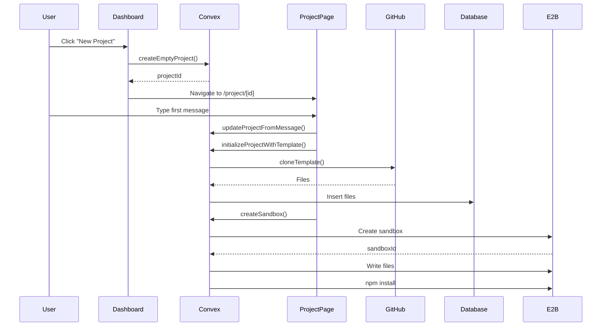

# Phase 1 Implementation Complete ✅

## What's Working

1. **Template Cloning** - GitHub template files are fetched and stored
2. **E2B Sandbox Creation** - Sandboxes spin up with cloned files
3. **npm Install** - Dependencies install automatically in sandbox
4. **Auto-initialization** - First message triggers full setup

## Files Created/Modified

### New Files
- `convex/templates.ts` - GitHub template cloning
- `convex/sandbox.ts` - E2B sandbox lifecycle management
- `IMPLEMENTATION_PHASES.md` - Full implementation plan

### Modified Files
- `convex/schema.ts` - Added `sandboxId` field to projects
- `convex/projects.ts` - Added `initializeProjectWithTemplate` action
- `convex/files.ts` - Added `getFiles` query for internal use
- `app/project/[id]/page.tsx` - Integrated template initialization

## How It Works



## Configuration Required

Add to `.env.local`:
```bash
E2B_API_KEY=your_actual_key_here
```

Get your key from: https://e2b.dev/dashboard

## Testing Phase 1

1. Start the app: `bun dev`
2. Start Convex: `bunx convex dev`
3. Create new project
4. Send first message (e.g., "Hi")
5. Check Convex logs for:
   - "Cloned X files from template"
   - "Creating sandbox..."
   - "Sandbox created: ..."
   - "npm install output: ..."

## Known Limitations (By Design)

- Dev server not started yet (Phase 2)
- No preview URL yet (Phase 2)
- No file editing yet (Phase 3)
- No Monaco editor yet (Phase 3)

## Next: Phase 2

Now ready to implement:
1. Start/Stop dev server buttons
2. Parse preview URL from dev output
3. Display preview in iframe
