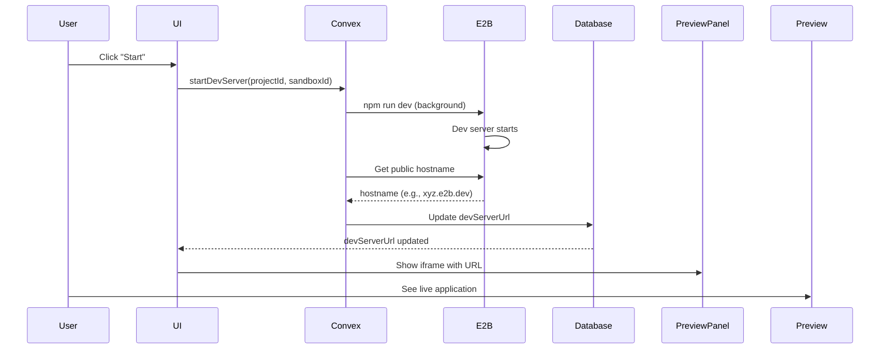

# Phase 2 Implementation Complete ✅

## What's Working

1. **Start Dev Server** - Click "Start" to launch `npm run dev` in E2B sandbox
2. **Stop Dev Server** - Click "Stop" to kill the dev server process
3. **Preview URL** - Automatically captured and displayed when server starts
4. **Live Preview** - iframe shows the running application with HMR support
5. **Server Status** - Visual indicator showing when server is running

## Files Created/Modified

### Modified Files

- `convex/schema.ts` - Added `devServerUrl` field to projects table
- `convex/projects.ts` - Added `updateDevServerUrl` mutation
- `convex/sandbox.ts` - Added `startDevServer` and `stopDevServer` actions
- `app/project/[id]/page.tsx` - Wired up Start/Stop button handlers
- `components/PreviewPanel.tsx` - Enhanced to handle preview URL updates

## How It Works

## Key Features

### 1. Start Dev Server

- Connects to existing E2B sandbox
- Runs `npm run dev` as background process
- Waits 3 seconds for server initialization
- Gets public hostname for port 5173 (Vite default)
- Stores preview URL in Convex database
- URL format: `https://{hostname}`

### 2. Stop Dev Server

- Kills all node processes in sandbox
- Clears `devServerUrl` from database
- UI automatically hides preview iframe
- Button changes back to "Start" state

### 3. UI Integration

- Start/Stop button in tab bar
- Disabled until sandbox is created
- Shows "Running" indicator with green pulse when active
- Preview panel shows helpful message when no URL available

### 4. URL Synchronization

- Preview URL stored in Convex database as single source of truth
- UI syncs automatically via `useEffect` on `project.devServerUrl`
- Server state (running/stopped) derived from URL presence

## Testing Phase 2

1. Start the app: `bun dev`
2. Start Convex: `bunx convex dev`
3. Create new project or open existing one
4. Wait for sandbox creation (from Phase 1)
5. Click "Start" button
6. Check Convex logs for:
   - "Starting dev server in sandbox: ..."
   - "Dev server running at: https://..."
7. Verify preview iframe appears
8. Click "Stop" button
9. Verify preview disappears

## Known Limitations (By Design)

- Fixed port 5173 (Vite default) - works for React template
- 3-second wait for server startup (hardcoded)
- No real-time logs from dev server yet
- No error handling if port is already in use
- File editing not implemented yet (Phase 3)

## Next: Phase 3

Now ready to implement:

1. Monaco editor integration
2. File tree with file selection
3. File content editing
4. Live sync from Convex → E2B
5. Auto-refresh on file changes

## Technical Notes

### E2B Public URLs

- E2B provides public URLs for sandbox ports
- Format: `sandbox.getHost(port)` returns hostname
- Full URL: `https://{hostname}`
- URLs are stable for the lifetime of the sandbox

### Background Processes

- Dev server runs with `background: true`
- Process continues even after command completes
- Must explicitly kill processes to stop server

### Convex Flow

- Actions can connect to E2B sandboxes
- Mutations update database state
- Queries automatically trigger UI updates
- No manual state management needed
